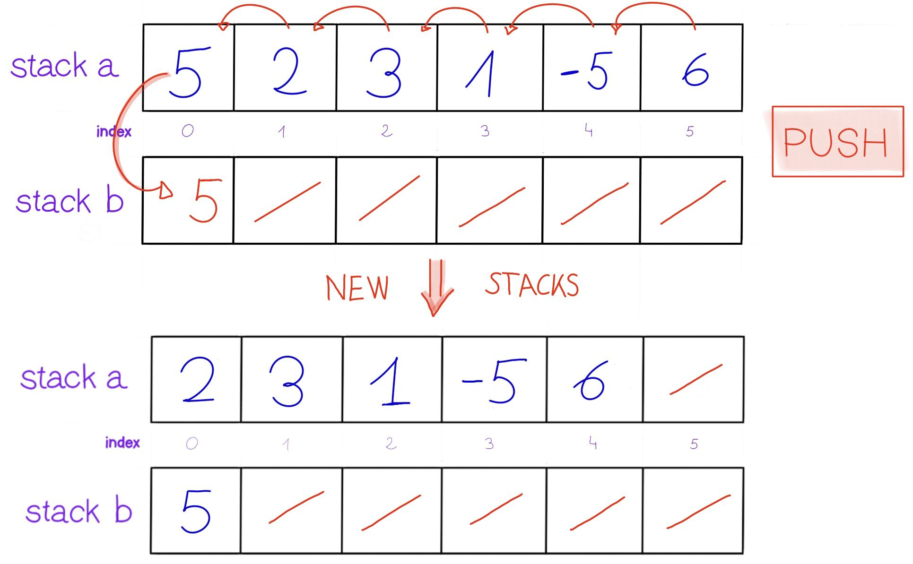
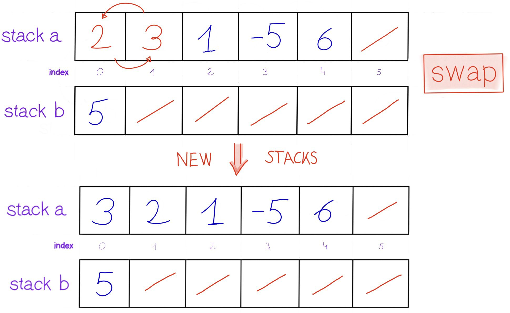
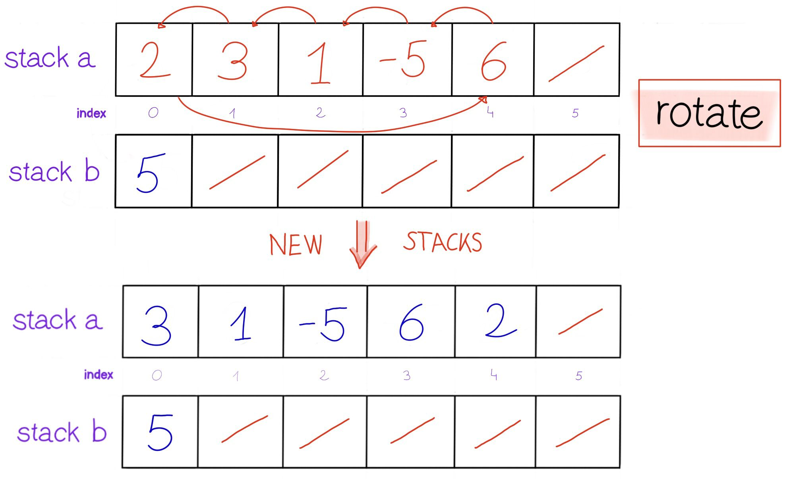

Push Swap is an algorithmic challenge focused on sorting integers using a limited set of operations. I successfully implemented the Turk algorithm to minimize the number of moves required. 🧩 🔥 

## Operation
## push

## swap

## rotate

## rotate reverse

## Ressources
Here are some resources that can help you do this project:
<a href="https://42-cursus.gitbook.io/guide/rank-02/push_swap">push swap</a>  
<a href="https://www.youtube.com/playlist?list=PLZpzLuUp9qXyWylaS9C8Z4uIKWZxQc3Cq">Sorting Algorithm in Arabic</a>

**made with love by <a href="https://www.linkedin.com/in/abdellah-karani-965928294/">Abdellah Karani</a>**

